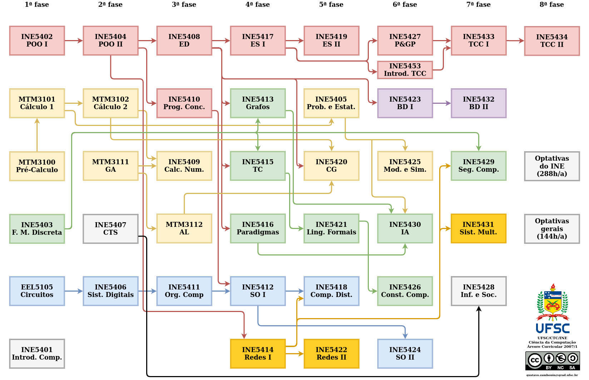

An attempt to organize and update the old course progression tree used by
undergraduate computer science students of UFSC. The programs for each course
were added as links to each respective box on the SVG version. Powered by
[draw.io](https://draw.io/).

Optional and other courses may be found at
[planos.inf.ufsc.br](https://planos.inf.ufsc.br/). The original curriculum
document from the university may be read
[here](https://cagr.sistemas.ufsc.br/relatorios/curriculoCurso?curso=208&curriculo=20071).
For critics and suggestions: `gustavo.zambonin at grad.ufsc.br`. This content
can also be reached at
[zambonin.github.io/curriculum-graph](https://zambonin.github.io/curriculum-graph/).
