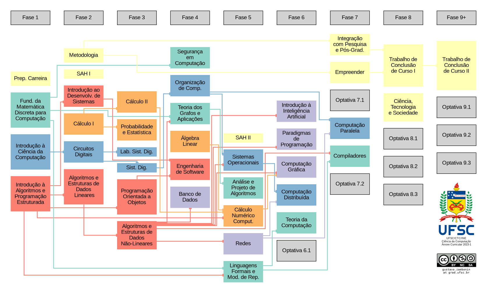

An attempt to organize and update the old course progression tree used by
undergraduate computer science students of UFSC. Powered by
[Graphviz](https://graphviz.org/).

The programs for each course may be found at
[planos.inf.ufsc.br](https://planos.inf.ufsc.br/),
[mtm.ufsc.br](http://mtm.ufsc.br/ensino/index.html) and
[deel.ufsc.br](https://deel.ufsc.br/departamento/disciplinas/plano-de-ensino-das-disciplinas/). The
original curriculum document from the university may be read
[here](https://cagr.sistemas.ufsc.br/relatorios/curriculoCurso?curso=208&curriculo=20071). For
critics and suggestions: `gustavo.zambonin at grad.ufsc.br`. This content can
also be reached at
[zambonin.github.io/curriculum-graph](https://zambonin.github.io/curriculum-graph/).
